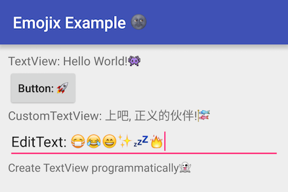

# Emojix
[](http://www.apache.org/licenses/LICENSE-2.0.html) [](https://jitpack.io/#nekocode/Emojix)

This library help using **[apple style emojis](http://unicode.org/emoji/charts/full-emoji-list.html)** on your android application the easiest way. **Unlike [emojicon](https://github.com/rockerhieu/emojicon), this library is non-invasive. Just need to add only a little code to your project.**

Another thing you need to know is that this library will increase your apk size about 5 MB, because it contains all emoji icon files.

### Preview


### Using with gradle
- Add the JitPack repository to your root build.gradle:
```gradle
repositories {
    maven { url "https://jitpack.io" }
}
```

- Add the dependency to your sub build.gradle:
```gradle
dependencies {
    compile 'com.github.nekocode:Emojix:{lastest-version}'
}
```

### Usage

Just wrap the `Activity` Context, it will let all the `TextView`s (or other views inherit from `TextView`) replace the emoji characters with apple style icons:

```java
@Override
protected void attachBaseContext(Context newBase) {
    super.attachBaseContext(Emojix.wrap(newBase));
}
```

Now, everything is OK! Anyway, for implementing emoji to the whole application you can add these code to your `BaseActivity`.

Note that if it is not working with any views, you can wrap the view manually:

```java
Emojix.wrapView(view);
```

### Thanks

Thanks to the [emojicon](https://github.com/rockerhieu/emojicon) and [Calligraphy](https://github.com/chrisjenx/Calligraphy) projects. This project is based on their contributions.
